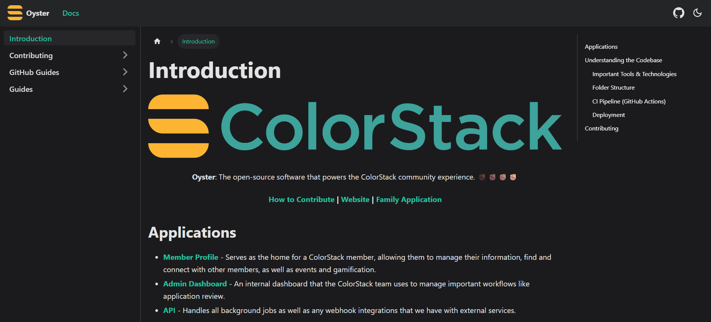

# Oyster Documentation

Welcome to the Oyster Documentation project! This repository contains technical documentation for Oyster, aiming to help users and contributors understand how to use and maintain the Oyster project.

## About

This documentation covers various aspects of Oyster, including:

- Onboarding guides
- Common bug fixes
- Tutorials
- Example code
- And more...

## Website

This documentation website is built using [Docusaurus](https://docusaurus.io/), a modern static website generator.

# Contributing

We welcome contributions to the Oyster Documentation! Please refer to the [CONTRIBUTING.md](CONTRIBUTING.md) file for detailed information on how to contribute to this project.
